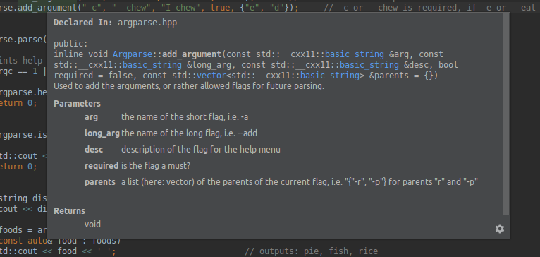

# ARGPARSE CPP  
An argument parser for CPP in CPP.  
## Introduction  
ArgparseCPP is a small header file to allow parsing and reading command inputs from a terminal.  
It is highly influenced by the python's argparse library.  
## Features  
- Support for required/optional arguments  
- Support for hierachy arguments (i.e. arg2 is required ONLY IF arg1 is given)  
- Support for small and/or long arguments  
- Support for parsing value given through equality (i.e. `--name=author`)
- Support for automatically generated help menu  
- Support for reading `bool`, `floating points`, `integers` or `std::string`  
- Support for reading lists `(std::vector<>)` of the value types mentioned above  
- Support for error messages: Error message are (per default ... can be changed though) automatically 
given, when the user inputs wrong arguments. `invalid_input` is thrown.  
- Support for configurations and settings: The developper can specify the behavior of the library 
(i.e. automatically print help when no argument is given) 


## Theorie of Operation  
The library is a single header file `include/argparse.hpp` build using C++11 and the standard libraries.  
No other requirements are necessary except for the standard `g++` compiler, `Cmake` to build and for the tests.  
## Installation  
Simply copy the `include/argparse.hpp` file and include it into your project.  
If you wish to get the binary data, build with (from this source directory) 
```bash
    $ cmake . -Bbuild 
```  
then 
```bash
    $ make --directory=build
```  
## Usage  
Examples are much easier to use for explanations. Sooo ...  
### Example
```C++
    /// main.cpp (your file in which you which to use the library)
    #include <iostream>
    #include "include/argparse.hpp"
    
    int main(int argc, char** argv) {
    
        // Run with: ./argparseCPP --cook rice -e pie fish rice -c 10 -d water
    
        Argparse argparse("TestProgram v1.0.0");
    
        argparse.add_argument("--cook", "I cook", true);                // Requires --cook argument
        argparse.add_argument("-e", "--eat", "I eat", false);           // -e or --eat is optional
        argparse.add_argument("-d", "--drink", "I drink", false);       // -d or --drink is optional
        argparse.add_argument("-c", "--chew", "I chew", true, {"e", "d"});     // -c or --chew is required, if -e or --eat, or -d or --drink is given
    
    
        argparse.parse(argc, argv);
    
        // Prints help if no parameter was given or if -h or --help is received as argument
        if (argc == 1 || argparse.isHelp())
        {
            argparse.help();
            return 0;
        }
    
        if (argparse.isVersion())
        {
            std::cout << "v1.0.0" << std::endl;
            return 0;
        }
    
        std::string dish = argparse.get<std::string>("cook");
        std::cout << dish << '\n';                             // outputs: rice
    
        auto foods = argparse.getv<std::string>("e");           // required -c (or --chew) arguments
        for (const auto& food : foods)
            std::cout << food << ' ';                          // outputs: pie, fish, rice
        std::cout << '\n';
        auto numberofChews = argparse.get<int>("c");
        std::cout << numberofChews << '\n';                // outputs: 10
    
        bool drank = argparse.get<bool>("d");
        std::cout << (drank ? "I drank" : "I didn't drink") << std::endl;   // outputs: I drank
    
        return EXIT_SUCCESS;
    }
```  
This example can be found in the `main.cpp` file.  
The console ouput when not parameter is given:  
```bash
    TestProgram v1.0.0
    Usage: argparseCPP [--cook] [options] 
    [Required]
              --cook              I cook              
    [Optional]
    -e        --eat               I eat               
    -d        --drink             I drink             
    -c        --chew              I chew              
    -v        --version           Version             
    -h        --help              Help  
```  
### Configuration and Settings:  
Configurations and Settings can be changed before calling the `parse` function, with  
```C++
    argparse.configuration({
        {"path", "myNewPath"},
        {"version", "15.06"},
        {"description", "new Description"}
    });
    
    argparse.settings({
        {"colors", false},                          // Allow colors (soon)
        {"help", true},                             // Allow to show help in the help menu
        {"auto_help", false},                       // Allow automatic help when no arguments are given
        {"version", true},                          // Allow to show version in the help menu
        {"error_msg", true}                         // Allow argeparse to throw errors
    });
    
```  
## Miscellaneaous  
### Comments  
The project supports comments. With CLion:  


## TODO:  
- [x] Add support for multiple parents  
- [x] Add doxygen comments
- [ ] Add support for different flags beginnings: '-e' and '*e' for example
- [ ] Add function callback support  
- [ ] Add better depths   
- [ ] Add support for colors  
- [ ] Add more settings  
- [ ] Performance improvements if possible


